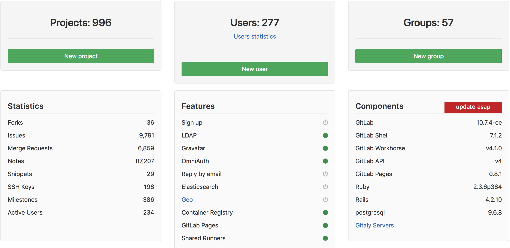
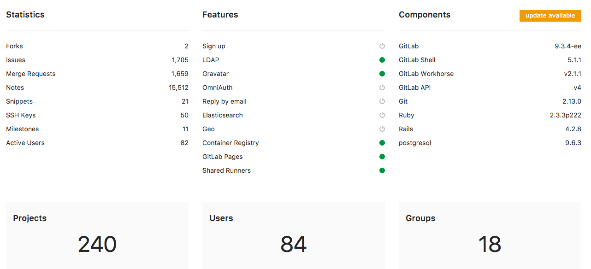
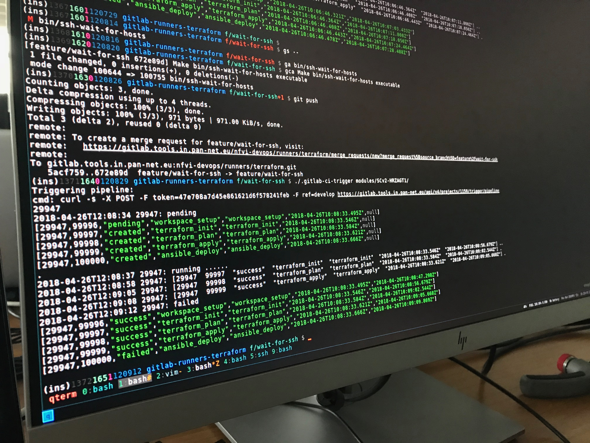
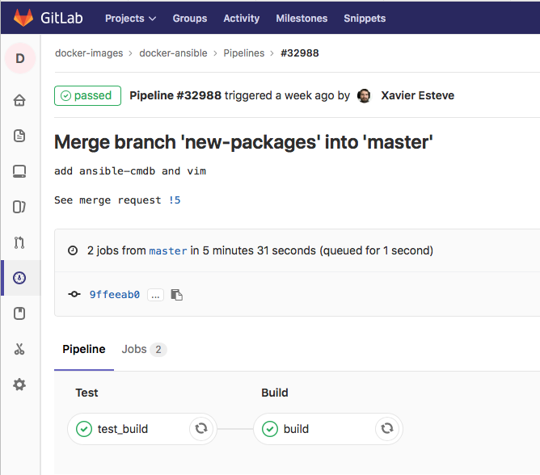
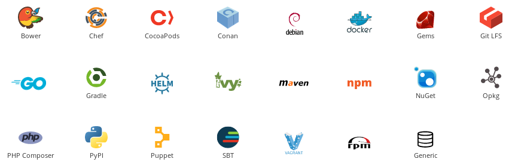
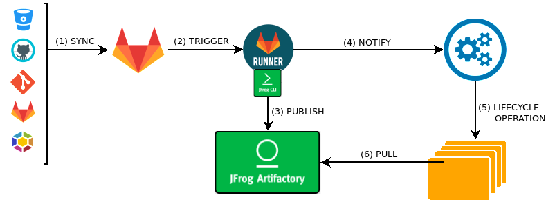
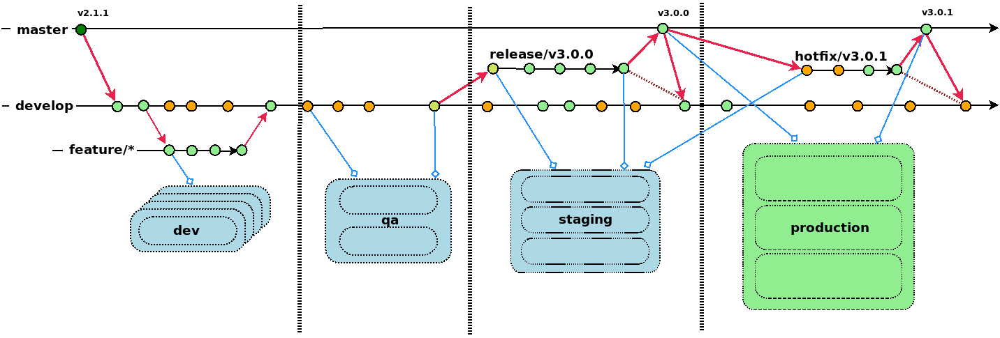

# <span style="font-family:Helvetica Neue; font-weight:bold">
<span style="color:#e49436">CICD Learnings</span>

* Lessons learnt from CICD
* Progress Updates to CICD Strategy/Tools
* Problems, Mitigations

---

## CI/CD

- Continuous Integration is the practice of integrating code into a shared repository and building/testing each change automatically
- Continuous Delivery adds that the software can be released to production at any time, often by automatically pushing changes to a staging system.
- Continuous Deployment goes further and pushes changes to production automatically.

+++


---

## Gitlab

- Version: 10.7 (One month behind Gitlab)



+++

## One year ago



+++

## Gitlab CI/CD Statistics



+++

- Total Pipelines: 34937
- Total Jobs: 117579
- Pipelines / day: ~90
- Jobs / day: ~300
- Shared runners: 4
- Private runners: 10

+++

## Gitlab CI/CD
- .gitlab-ci.yml file to define the stages and jobs
- Gitlab Runner is used to run the jobs and send the results back to GitLab

+++


+++

## gitlab-ci.yml example

```yaml
image: docker:latest

stages:
  - test
  - build

variables:
  IMAGE_TAG: $CI_REGISTRY_IMAGE:$CI_COMMIT_SHA

before_script:
  - docker login -u gitlab-ci-token -p $CI_JOB_TOKEN $CI_REGISTRY

test_build:
  stage: test
  tags:
    - docker
  script:
    - docker build -t $IMAGE_TAG -t $CI_REGISTRY_IMAGE:latest .

build:
  stage: build
  tags:
    - docker
  script:
    - docker build -t $IMAGE_TAG -t $CI_REGISTRY_IMAGE:latest .
    - docker push $IMAGE_TAG
    - docker push $CI_REGISTRY_IMAGE:latest
  only:
    - master
```

+++



---

## Runners Topology

Picture here

- Aim to provide a gitlab runner architecture
  - Across datacenters
  - Across infrastructure and tenants
  - Decentralized / self-service configuration

+++

## Zagreb Runners - Progress

- Demand for runners local to datacenters
  - Runner consistency required across DCs
- Shared Runners deployed in Zagreb
  - complements those available in Budapest
  - Some differences
- Allow routing/pinning of CI jobs to datacenters
  - CI Jobs just need tags (e.g. SCv2-HRZAGT1, SC-HUBUDB1)

+++

### Zagreb Runners - Progress ...

- Full end-to-end pipeline with terraform/ansible on SCv2
  - Better integration with Openstack (Over SCv1)
  - Runners themselves deployed by (meta) pipelines
  - Deployable using minimal requirements (just itot-jumphost)
  - Better separation of concerns
    - Env. config is split away from code
    - Forces consistency across runners in current/future sites.
- Ready to deploy runners in other (SCv2) sites

+++

## Runners - Use cases ..

- Designed for Non-Critical workloads, provided as best-effort
  - Facilitate the bootstrap of OS tenant deployments
  - Fallback for CI jobs run in Budapest (Caveats apply!)
  - Not a substitute for a real IaaS/PaaS
  - Services should be deployed to tenants
- CI Jobs will start to require tags with DC Label/Identifier
  - Requires update to .gitlab-ci.yml
  - Affects docker images (many/most tied to Budapest)

Forced to if zag is a fall back

+++

## Runners - Multi-stage CI Jobs

- Shared runners have problems
  - Runner outside env (SGs required to allow SSH, etc in)
  - Security of secrets (different jobs run as the same user)
  - (arguably) harder to debug than (re)using an accessible runner
- Our recommendations
  - Setup Multi-stage pipelines
  - Incorporate dedicated/private runners for in-tenant config/deploy
  - Easier for branch-to-env routing of CI jobs
  - We provide an ansible role and examples, documentation
  - `ansible-roles/ansible-gitlab-runner/`

+++

### Impediments - PNB

- Testing/adoption was blocked by lack of PNB
  - IPSec tunnels, poor bandwidth/latency to gitlab, etc
  - Problems with runner registration, preparation, git cloning
  - Need to ensure all DC rollouts are on PNB!!
- Possible improvement with bootstrapping
  - Runner needed to run runner deployment
  - We have a non-optimal hack using the itot-jumphost
  - Could deploy a runner as part of DC rollout (??)

+++

## Impediment - HTTP_PROXY

- SCv1 design requires use of a http_proxy to access remote content
  - Currently not possible to port these CI jobs as-is to Zagreb
  - Jobs/images for Budapest jobs 'bake in' environment config (e.g. HTTP_PROXY)
  - Env config can (should) be managed by runners (plan to fix)
  - Or we defer the need for HTTP_PROXY
  - Still requires end-users to update
- Untagged jobs? (Backup for runners in SC Budapest)

+++

### Problems

- (Non)-Portability of images prepared in SC-HUBUDB1
- SCv2 Reliability

---

## Beryllium CI/CD

- IaC
- No push to master branch
- MR approvers to do code review
- Deployment with Foundation and Juju
- Common bundle for all the deployments
- Differences between environments applied with `juju overlay` option

+++

## CI/CD Improvements

- Integration with NetBox
- Automatically import information into `.yaml` files

+++

## CI/CD Improvements - Config Mgmt

- Common bundle for all deployments
- Bundle configuration merged at runtime
- Follows DRY ("Don't Repeat Yourself") principles
- Avoids having to make changes to multiple repos

+++

## Foundation

The Good:

- Automates deployment from MAAS
- Simplified yaml config files
- Faster deployment

The bad:
- Not idempotent, therefore not ready for CI/CD

The ugly:
- Not opensource

---

### Artifactory

picture here ...

- The universal binary repository manager
  - Internal + External binaries
  - Source code?
- Optimized pipelines
  - Code + binary reuse
  - Consistent deployments
  - QA
- Validated pipelines
  - Binaries are sometimes blackholes
  - DevSecOps

+++

### Binary distribution + access



- Access vendor distribution repos/channels
  - Access of 3rd parties/upstream binaries
  - Point of control for binaries entering the system

+++

### Repository for custom artefacts

- Repository infrastructure for VNF artefacts
  - VM images, Software Packages, etc
  - CSAR Files
  - Test Artefacts
- Versioned artefacts
    - Metadata PropertySets (e.g. Datacenter location, VNF, En)
    - Rich query language
- Publish once - deploy anywhere
  - Aim to provide access across all datacenters
    - datacenter-local caching proxies or JFrog Enterprise+

+++

#### Artefacts for Application lifecycle

[Package Stack](img/pkg-stack.png)

+++

#### Artefacts for Application lifecycle

- What if I need
  - To take on upstream improvements/features |
  - Security hotfixes, bugfixes, etc |
- Conversely, What if we need older versions no longer available? |

+++

#### Build infrastructure



+++

#### Artifact delivery infrastrcture


+++

### Trusted container repository

- Support for docker repositories
  - Will eventually replace the gitlab registry
- Opens possibility for image inspection (JFrog XRay/Enterprise+)
- Support for Kubernetes Helm Charts (Beta!)
- Odd requirement on DNS

+++

### Roadmap

- Q1-Q2
  - Expose out-of-box repos
  - Beta
- Q3
  - Further requirements gathering
  - Replication
  - Build Integration

+++

### Rollout status

- Slow difficult process
- Beta has been available since end of march
  - Adoption is low
- Problems with connectivity to artifactory
  - Unable to prove integrations
  - LDAP/IDP
  - Gitlab Runners

+++

### Rollout status

- Testing of typical use-cases is mostly complete
- Still to cover
  - VNF repositories (Onboarding/Orchestration/LTaaS)
  - Delegated administration (user/groups)
  - Bridge to gitlab (VCS repos - ansible, terraform, etc)
  - Repository Replication

+++

## TODO



- why juju/foundation
- common bundle
- one bundle per deployment before -
- Start with branch-env


